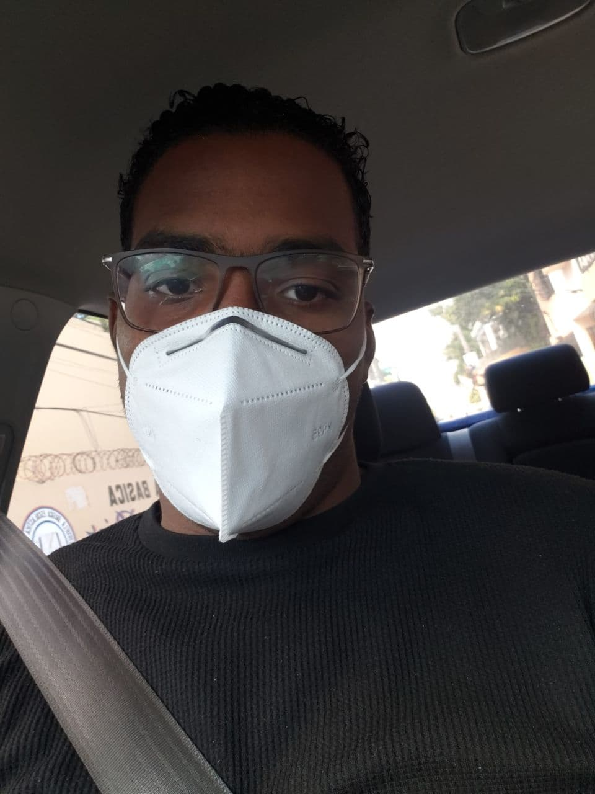

<!-- 1- Un home donde colocara una foto suya así como una pequeña descripción sobre usted mismo, ademas de que debe tener un menú que permita navegar a las demás paginas de su site-->
<!DOCTYPE html>
<html lang="en">
  <head>
    <meta charset="UTF-8" />
    <meta http-equiv="X-UA-Compatible" content="IE=edge" />
    <meta name="viewport" content="width=device-width, initial-scale=1.0" />
    <title>Personal Site</title>
    <link rel="stylesheet" href="./assets/css/style.css" />
    <link rel="stylesheet" href="/assets/css/index.css" />
  </head>
  <body>
    

      <h1>Home</h1>
      

        <ul>
          <li><a href="index.html">Home</a></li>
          <li><a href="values.html">Valores</a></li>
          <li><a href="knowledge.html">Conocimientos</a></li>
          <li><a href="projects.html">Proyectos</a></li>
          <li><a href="contact.html">Contactanos</a></li>
        </ul>
      

      

        
        <h2>Descripcion</h2>
        

          Tengo 23 años, soy el segundo de 4 hermanos y resido en Santo Domingo
          Este en Republica Dominicana. Me gusta el Data Science y jugar
          baloncesto. Ahora que estoy conociendo el mundo Web es algo que me
          gusta cada vez mas.
        

      

    

  </body>
</html>
